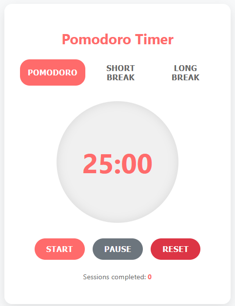

After my ADHD diagnosis, the [Pomodoro Technique](https://en.wikipedia.org/wiki/Pomodoro_Technique) became essential for managing my focus. As someone who spends most of my day in [Obsidian](https://obsidian.md/), I wanted a timer that lived seamlessly within my note-taking environment without cluttering my workspace.

That's how [PomoBar](https://semanticdata.github.io/obsidian-pomodoro/) was born: a minimalist Pomodoro timer that sits quietly in Obsidian's status bar, ready when I need it but invisible when I don't.

PomoBar was one of those projects I built during my year of silence, focused on solving a real problem I faced daily, but never taking the time to document the process. Looking back, that was a mistake. The development journey taught me lessons about constraints, user experience, and the value of building tools you actually use.

## From HTML Prototype to Production Plugin

Before diving into Obsidian plugin development, I built a standalone HTML version in [CodePen](https://codepen.io/semanticdata/pen/PwwpZgE) to test the concept. Working with familiar HTML, CSS, and JavaScript let me focus on the user experience without learning new APIs. The prototype had a full visual interface with buttons and progress rings – essentially a traditional web app.



But when I moved to create the Obsidian plugin, everything changed. This was my first plugin and my first real TypeScript project. I was suddenly wrestling with type definitions, Obsidian's API patterns, and figuring out how to cram a full timer interface into a tiny status bar element.


## The Problem with Existing Solutions

Before building PomoBar, I tried several Pomodoro apps and browser extensions. They all shared similar problems:

- **Context switching**: Alt+tabbing to external apps broke my concentration when I was finally focused
- **Visual clutter**: Most timers demanded screen real estate I couldn't spare
- **Over-engineering**: Complex features I never used made simple tasks unnecessarily complicated

I needed something that followed the Unix philosophy: do one thing and do it well. A timer that would stay out of my way but be instantly accessible when needed.

## Architecture Decisions: Building for Maintainability

What started as a [single-file experiment](https://github.com/semanticdata/obsidian-pomodoro/blob/9e3828254aa1b61c6f98b70fb9c50df4508215c8/main.ts) evolved into a properly structured project. I learned the hard way that even simple plugins benefit from clean architecture.

The current structure separates concerns clearly:

- `main.ts`: Plugin lifecycle and Obsidian integration
- `timer.ts`: All timer logic and state management
- `SettingsTab.ts`: Configuration interface
- `types.ts`: TypeScript interfaces and type definitions
- `constants.ts`: Application constants and enums

This modular approach made the codebase easier to test, debug, and extend. When I needed to add features like optional status bar icons or improved memory management, I could modify individual components without touching the core timer logic.

## Design Philosophy: Flexible Minimalism

The core design principle for PomoBar remained radical simplicity, but with thoughtful flexibility:

- A soft timer display in the status bar showing `MM:SS`
- Optional icon that changes based on timer state
- Left click to start/pause
- Middle click to cycle between work, short break, and long break
- Right click to reset (when paused)

The interface stays minimal, but users can customize duration settings and choose whether to show the timer icon. Smart defaults (25/5/15 minutes) work for most people, but the plugin adapts to different workflows.

## Technical Deep Dives

Building something simple sounds easy until you actually try it. What seemed like "just put a timer in the status bar" quickly revealed layers of complexity I hadn't anticipated.

### State Management and Memory Safety

The timer tracks multiple pieces of state: current mode, remaining time, work interval count, and running status. Getting this right required careful attention to cleanup:

```typescript
cleanup() {
    // Clean up any remaining intervals
    this.registeredIntervals.forEach(intervalId => {
        window.clearInterval(intervalId);
    });
    this.registeredIntervals.clear();
}
```

JavaScript's `setInterval` can create memory leaks if not handled correctly, especially in a plugin environment where code gets reloaded frequently during development. Obsidian's `registerInterval` method helps, but proper manual cleanup ensures reliability.

### User Feedback Integration

Early feedback taught me important lessons about user expectations. A GitHub issue pointed out that users wanted the plugin to automatically cycle through the traditional Pomodoro sequence: _work_ → _short break_ → _work_ → _short break_ → _work_ → _long break_. The user noted they were using "25/5 cycles with the occasional 15 extended break" and wanted the timer to default to 5-minute breaks instead of requiring manual selection each time.

This feedback was really helpful. It highlighted a core workflow need I hadn't fully considered. Instead of adding buttons or dropdowns, I implemented automatic cycling while keeping the same three-click interaction model.

### TypeScript in Practice

Moving from vanilla JavaScript to TypeScript added complexity I hadn't expected, but the benefits became clear quickly:

```typescript
interface PomodoroSettings {
  workTime: number;
  shortBreakTime: number;
  longBreakTime: number;
  intervalsBeforeLongBreak: number;
  showIcon: boolean;
}
```

TypeScript caught several bugs during development that would have been runtime errors in JavaScript. The type safety made refactoring safer and the code more self-documenting.

## Modern Development Practices

Building PomoBar taught me the value of proper development tooling, even for small projects.

### Build System and Tooling

I experimented with different build systems before settling on **esbuild**. While I briefly tried **Vite** for its development features, **esbuild** proved more stable and performant for an Obsidian plugin. The build process handles TypeScript compilation, bundling, and development hot-reloading.

**ESLint** and proper TypeScript configuration catch issues before they reach users. The development experience improved dramatically once I had reliable linting and type checking in place.

### Testing and Validation

I added a **Jest** test suite to verify timer logic, settings validation, and plugin lifecycle management. Testing Obsidian plugins requires mocking the API, but the effort pays off in confidence and easier refactoring.

The settings validation alone prevented several user-facing bugs:

```typescript
private validateAndUpdateSetting(
    value: string,
    settingProperty: 'workTime' | 'shortBreakTime' | 'longBreakTime',
    resetAction: 'resetTimer' | 'resetPomodoroSession'
): boolean {
    const numValue = parseInt(value.trim());
    if (!isNaN(numValue) && numValue > 0 && Number.isInteger(Number(value.trim()))) {
        this.plugin.settings[settingProperty] = numValue;
        return true;
    }
    return false;
}
```

## Documentation as Development Practice

One lesson from my year of building in silence: document as you build, not after. PomoBar now includes:

- README: Clear installation and usage instructions
- CHANGELOG: Detailed release notes for every version
- CONTRIBUTING: Short guide on how to contribute to the project
- Documentation site: Built with MkDocs for comprehensive user guides

Writing documentation forces you to think clearly about user experience and API design. It also makes the project more welcoming to contributors and users.

## Current State and Lessons Learned

PomoBar today is a robust, well-tested plugin that hundreds of users use daily. What started as a simple timer evolved into a thoughtful tool that balances simplicity with reliability.

The biggest lessons weren't about TypeScript syntax or Obsidian APIs. They were about building software people actually use:

- **Start with real problems**: Build something you need, not something that sounds interesting
- **User feedback shapes everything**: GitHub issues taught me more about user needs than any amount of planning
- **Simple interfaces can hide complex implementations**: The three-click interaction model required careful state management underneath
- **Architecture matters even for small projects**: Clean separation of concerns makes everything easier

## Building Your Own Plugin

If you're interested in building Obsidian plugins, here's what I wish I'd known starting out:

1. **Start with a real need**: Build something you'll actually use daily
2. **Learn TypeScript properly**: Don't just get by with `@ts-ignore` comments
3. **Set up proper tooling early**: ESLint, testing, and build processes pay off quickly
4. **Document as you build**: Future you will thank present you
5. **Listen to user feedback**: GitHub issues contain valuable insights about real workflows

The complete [source code](https://github.com/semanticdata/obsidian-pomodoro) for PomoBar is available on GitHub, along with comprehensive documentation. If you decide to build your own plugin, I'd love to hear what problems you're solving. Sometimes the best ideas come from scratching your own itch.

## Final Thoughts

Building PomoBar taught me that effective tools don't need complex interfaces. Sometimes the software you forget you're using is exactly what you need.

This project also taught me something about the value of writing alongside building. I shipped PomoBar months ago, but only now am I capturing the lessons learned and design decisions made. The technical details are still fresh, but some of the emotional journey – the frustration with existing tools, the satisfaction of solving my own problem – has already faded.

Writing about projects after the fact is harder than writing during development, but it's still valuable. The technical lessons remain clear even if some of the emotional journey has faded. This is my reminder to document the process, not just the results.
