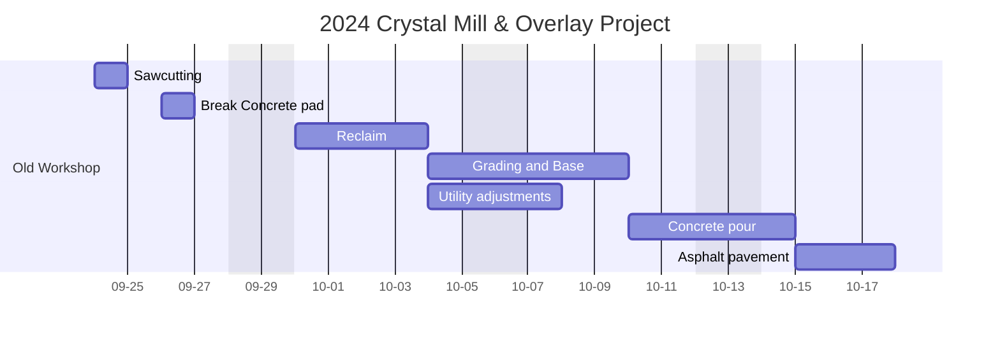
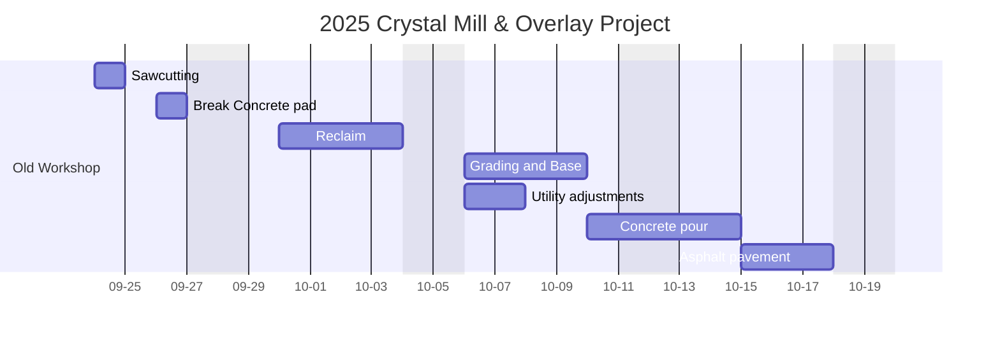

> [!note]
> This is a note callout

> [!warning]
> This is a warning callout

> [!tip]
> This is a tip callout

A few weeks ago, I got the kind of news that should've made me feel great but instead left me with a familiar knot in my stomach. The bids for our 2025 Sewer Rehabilitation Project had come in, and my estimates were high. Way high.

I'd estimated $65 per linear foot for the sewer liner work. The winning contractor came in at $42.90. The second-place bid was $51.31. In the project management world, being off by that much feels like failure, even when it's not.

But here's the thing that took me a while to process: being "wrong" in this case created something amazing. Because my estimates were conservative, we suddenly had enough budget to add 1,395 additional feet of sewer rehabilitation work. The same project budget that I thought would cover 1,855 feet could now handle 3,250 feet. The city got significantly more infrastructure improvement for the same money.

So why did I feel like I'd messed up instead of celebrating a win?

## The Project Details

Let me back up and explain what actually happened, because the numbers tell a story that's bigger than just one municipal project.

The City of Crystal needed to rehabilitate aging sewer lines – the kind of invisible infrastructure work that keeps cities functioning but never makes headlines. We were planning to install 1,855 linear feet of 8-inch sewer liner to fix deteriorating vitrified clay pipes that were decades old.

This was also Crystal's first major sewer rehabilitation project in years, which meant I needed to create the framework from scratch. I spent weeks consulting the City Engineers Association of Minnesota guidelines and working with colleagues from Le Sueur and Champlin to write new Standard Detail Specifications for Sewer Rehabilitation Procedures. It was important to get this right – not just for this project, but to establish standards for future work.

As the project manager, I had to estimate costs for budgeting and to set a baseline for evaluating contractor bids. I researched similar projects, talked to other municipalities, and landed on $65 per linear foot. It felt reasonable – maybe even slightly conservative, but I wanted to make sure we had adequate budget.

The project also included adding 550 feet of storm sewer liner work after we discovered a sinkhole near the original scope. This last-minute addition created some time pressure as we rushed to incorporate the additional work before the bid opening, but it didn't affect my core sewer rehabilitation estimates.

When the bids opened, reality hit differently. The winning contractor bid $42.90 per linear foot. The runner-up was $51.31. Both were significantly lower than my estimate, and both were qualified, reputable contractors.

The result? Instead of feeling constrained by budget, we could suddenly afford to add another 1,395 feet of sewer rehabilitation work that the city desperately needed. What started as one project became a much more comprehensive infrastructure improvement.

## The Pressure to Be Perfect

Here's what I couldn't shake, though: the voice in my head that kept saying I should've known better. That a good project manager would've hit closer to the actual market price. That being off by 30-50% meant I wasn't doing my job well enough.

This kind of thinking isn't unique to municipal engineering. There's this culture in project management – maybe in professional life generally – that treats precision as the ultimate goal. You're supposed to nail your estimates, predict outcomes accurately, and demonstrate that you truly understand your field through exact forecasting.

For someone with rejection sensitive dysphoria, this pressure hits differently. RSD is this intense fear of being criticized or perceived as incompetent, and it's common with ADHD. It's not just feeling bad about mistakes – it's the overwhelming certainty that any error proves you don't belong in your role. When my estimates came in high, RSD whispered that everyone would think I didn't know what I was doing.

The irony is almost funny: my "mistake" delivered objectively better outcomes for the city. More infrastructure repair, better use of taxpayer money, and the flexibility to address additional needs that emerged during the project. But my brain was stuck on the fact that I'd been "wrong" about the market pricing.

## Redefining Success

What if I've been thinking about this all wrong, though? What if conservative estimates aren't character flaws but strategic wisdom?

The truth is, I wasn't trying to predict the exact market price down to the penny. I was trying to ensure the city had adequate budget to complete necessary infrastructure work. Mission accomplished, in a bigger way than originally planned.

There's a difference between being precise and being prepared. Precision aims to hit exact targets. Preparation builds in buffers for the unknown variables that always show up in real projects. Maybe my ADHD brain, which tends to think about worst-case scenarios and plan for multiple contingencies, actually serves me well in this context.

This applies way beyond municipal engineering, too. How often do we beat ourselves up for overestimating how long a project will take, how much money we'll need, or how challenging something will be? We treat these "errors" as personal failings instead of recognizing them as useful caution.

When I plan extra time for a task and finish early, that's not poor time management – that's creating space for unexpected complications or higher-quality work. When I budget more money than I end up spending, that's not wasteful planning – that's building financial flexibility for opportunities or emergencies.

The fear of being wrong can actually prevent us from being usefully wrong. If I'd tried to estimate exactly what contractors would bid, I might've aimed for $45 per linear foot and left no room for additional work when the opportunity arose. The "mistake" of overestimating created possibilities that precision would've eliminated.

Sometimes the best thing you can be is strategically, beneficially wrong. Sometimes building in buffers serves everyone better than trying to hit bullseyes. And sometimes the thing that makes you feel like you failed is actually the thing that made everything work.

