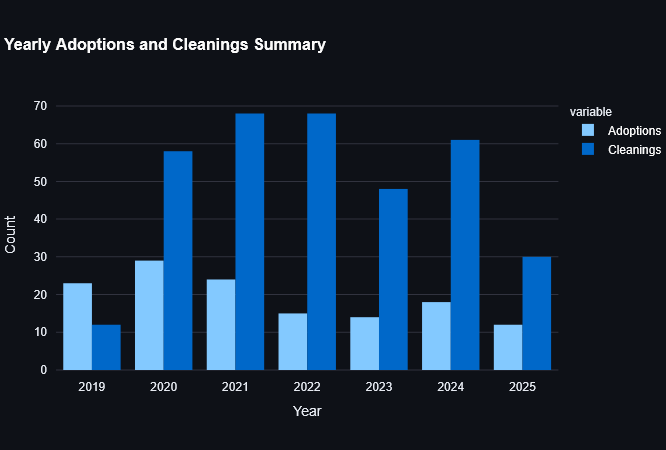
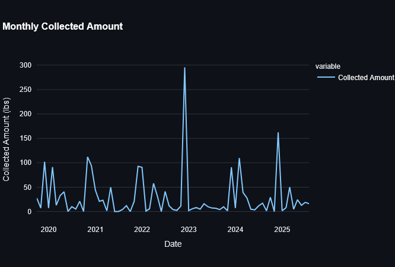
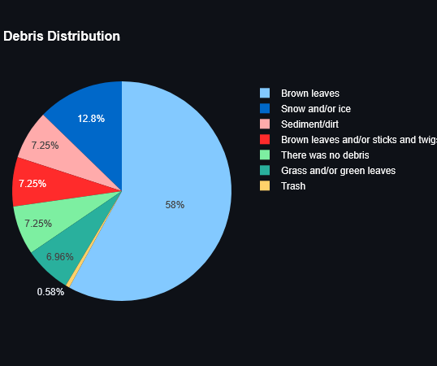
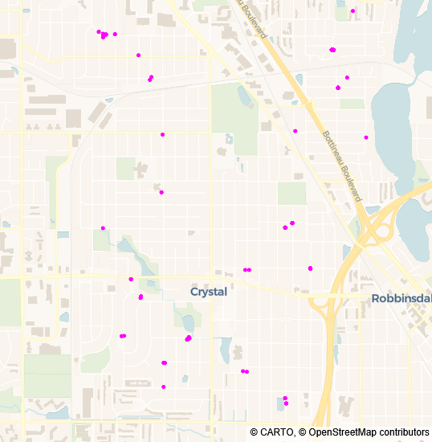

Every year, the City of Crystal, Minnesota, pays dues to participate in the [Clean Water MN](https://www.cleanwatermn.org/) and [Adopt-a-Drain](https://mn.adopt-a-drain.org/) programs. Recently, I was asked to justify these expenses to my manager, the City Engineer and Public Works Director. These programs are vital for our community outreach requirements under the MS4 (Municipal Separate Storm Sewer System) permit process, but it can be difficult to quantify their value during a budget review.

The data exists in the form of CSV exports, but raw spreadsheets rarely tell a compelling story. To defend the program, I built a dashboard as a proof of concept (PoC). My goal was to demonstrate how we can turn static rows of volunteer data into a clear narrative of community impact.

## The Tooling: Why Streamlit?

When building a PoC, the priority is speed. I chose Python because of its robust data ecosystem, specifically using [Streamlit](https://streamlit.io/) for the interface. Streamlit allowed me to turn a Python script into a functional web app without the overhead of traditional frontend development.

> [!info] Why use a PoC?
> This wasn't meant for production. By choosing Streamlit, I could focus on data logic rather than server management, allowing me to present a working prototype to stakeholders in a matter of days.

## Managing the Environment with `uv`

For this project, I used [uv](https://docs.astral.sh/uv/) by Astral for package management. For the dev community, the draw here is speed and the elimination of "dependency hell."

With `uv`, I don't have to manually manage a `.venv` folder. I can run the project with a single command:

```bash
uv run streamlit run main.py
```

`uv` handles the environment in the background, ensuring that [Pandas](https://pandas.pydata.org/), [Plotly](https://plotly.com/), and Streamlit are all synced. This makes the transition from a local script to a shareable dashboard significantly smoother.

## Processing the Data with Pandas

The Adopt-a-Drain data consists of two primary CSV files: adoption records and cleaning logs. Using Pandas, I cleaned and aggregated this data to look for trends. One of the most effective tools for this was the `resample` method.

```python
@st.cache_data
def get_monthly_cleanings(cleanings_df: pd.DataFrame) -> pd.Series:
    """Group cleaning events by month to see seasonal trends."""
    return cleanings_df.set_index("Cleaning Date").resample("ME").size()
```

This allowed me to see exactly when our volunteers are most active. Unsurprisingly, activity spikes in the spring and fall, but seeing it on a chart helps us plan our outreach efforts and our MS4 reporting more effectively.





## Visualizing Impact

To justify the program's cost, I used Streamlit's `metric` components to highlight three key numbers: total adoptions, total cleaning events, and the total weight of debris collected.

Seeing that residents have prevented over **2,800 lbs** of debris from entering our local waterways was an "aha" moment. While it felt incredible to see that number, I realized it wasn't about the code; it was about the power of a community working together. The dashboard simply made that collective effort visible.



I also included a simple geographic visualization using Plotly's `scatter_map`. By mapping the coordinates of every cleaning, we can see exactly which neighborhoods are most engaged and which watersheds are being protected.

```python
fig = px.scatter_map(
    cleanings,
    lat="Latitude",
    lon="Longitude",
    hover_name="User Display Name",
    color_discrete_sequence=["fuchsia"],
    zoom=12,
    height=550,
)
```



> [!tip] Handling Sparse Data
> Users often filter by year or watershed. I included defensive checks to ensure that if a filter returned no results, the app would display an `st.warning` rather than a generic Python error. This keeps the demo professional when presenting to leadership.

## Looking Ahead

This dashboard was a practical exercise in turning data into a tool for advocacy. It provided the visual evidence needed to support our continued participation in these clean water programs and simplified our permit reporting.

Because this prototype successfully bridged the gap between raw data and city leadership, I've been exploring more ways to use Python for civic data. This is the first of several projects I'm working on, and I look forward to sharing more as they develop.

You can visit the [Adopt-a-Drain Dashboard](https://adopt-a-drain.streamlit.app/). The complete source code is available on [GitHub](https://github.com/semanticdata/adopt-a-drain). If you're working with civic or environmental data, I hope this provides a useful starting point for your own visualizations.
