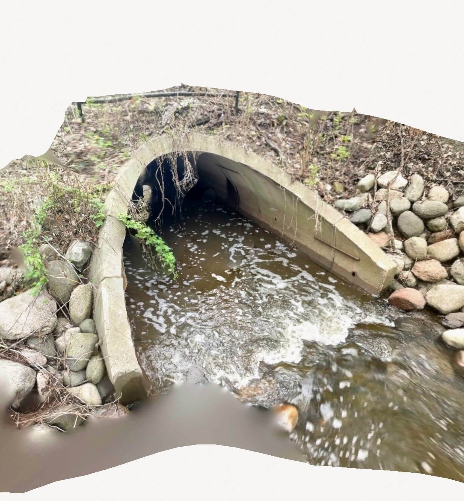
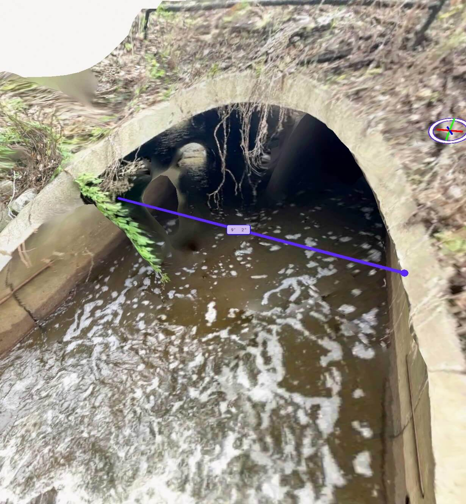
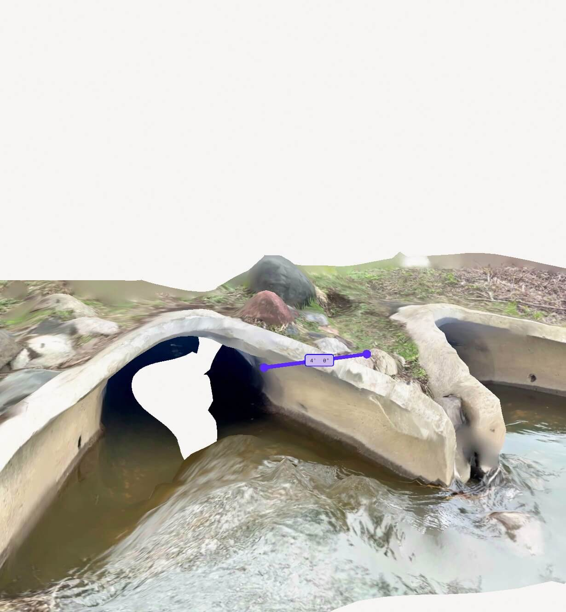
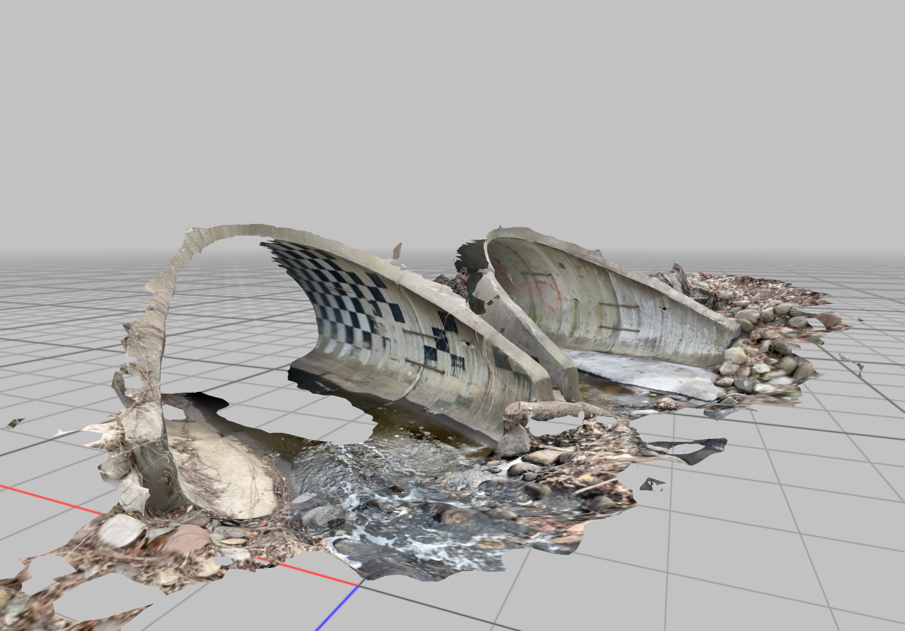
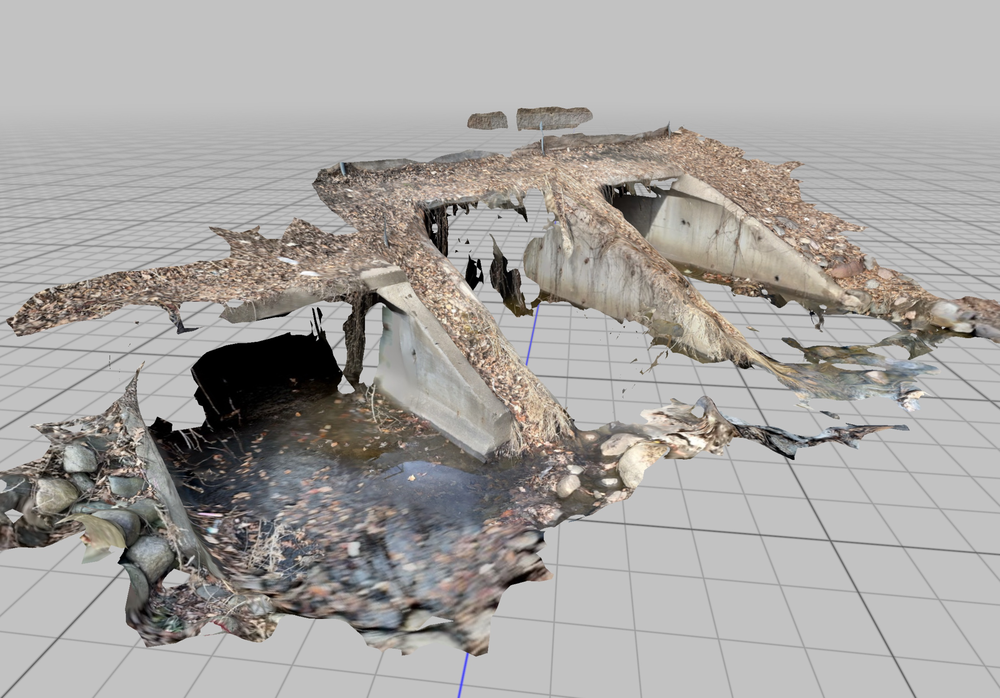

Succesfully loaded `.glb` and `.gltf` models with [\<model-viewer>](https://modelviewer.dev/). Only load the model when clicked, reducing unwanted JavaScript execution.

## Single Culvert

<is-land on:interaction>

Click here to load the model!

<template data-island>

<model-viewer alt="A culvert." src="/assets/5_2_2025.glb" camera-controls auto-rotate touch-action="pan-y" camera-orbit="145deg 55deg 4m" shadow-intensity="1" style="height:600px;width:100%;border:1px solid orange;overflow-x: hidden;"></model-viewer>
</template>
</is-land>

### Measurement

## Double Culvert

<is-land on:interaction>

Click here to load the model!

<template data-island>

<model-viewer alt="A culvert." src="/assets/5_2_2025-double.glb" camera-controls auto-rotate touch-action="pan-y" camera-orbit="145deg 55deg 4m" shadow-intensity="1" style="height:600px;width:100%;border:1px solid orange;overflow-x: hidden;"></model-viewer>
</template>
</is-land>

### Measurement

---

## Modular App

### Culvert A

<is-land on:interaction>

Click here to load the model!

<template data-island>

<model-viewer alt="A culvert." src="https://demos.emilyleanne.com/36-georgia-y.gltf" camera-controls auto-rotate touch-action="pan-y" camera-orbit="145deg 55deg 4m" shadow-intensity="1" style="height:600px;width:100%;border:1px solid orange;overflow-x: hidden;"></model-viewer>
</template>
</is-land>

#### Screenshot

### Culvert B

<is-land on:interaction>

Click here to load the model!

<template data-island>
<model-viewer alt="A culvert." src="https://demos.emilyleanne.com/36-hampshire-y.gltf" camera-controls auto-rotate touch-action="pan-y" camera-orbit="145deg 55deg 4m" shadow-intensity="1" style="height:600px;width:100%;border:1px solid orange;overflow-x: hidden;"></model-viewer>
</template>
</is-land>

#### Screenshot

