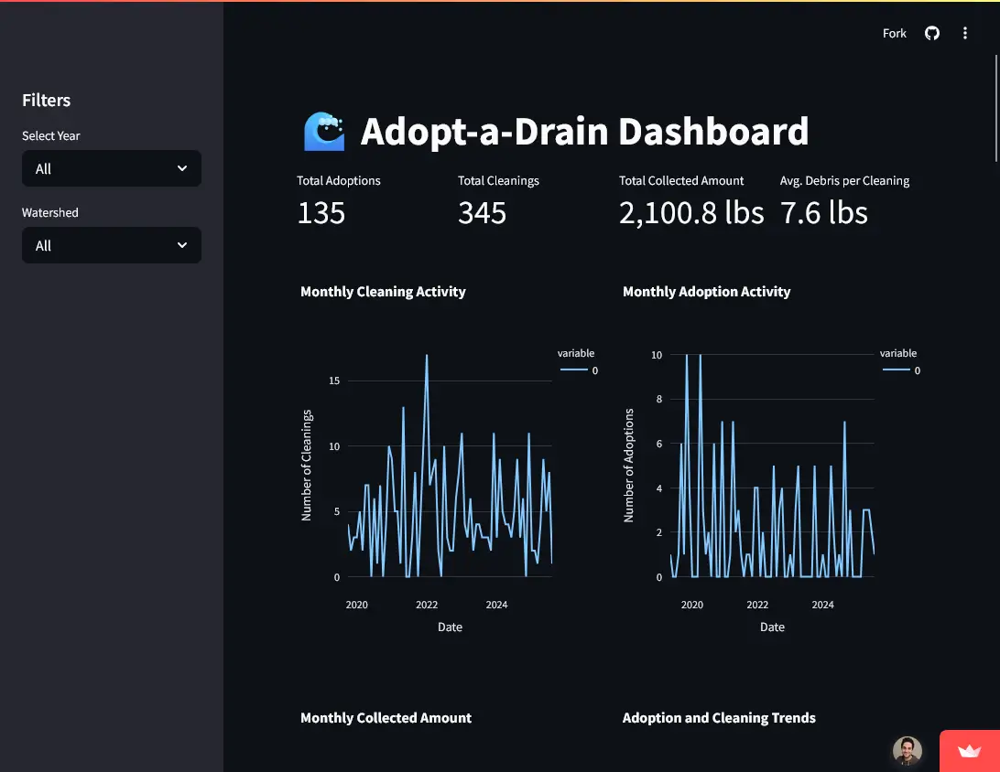

A Streamlit dashboard that visualizes volunteer impact and debris collection for Crystal, Minnesota's Adopt-a-Drain program. Transforms raw CSV data into compelling visual narratives for program justification and MS4 permit reporting.

[Live Demo](https://adopt-a-drain.streamlit.app/)

## Features

- **Key Metrics Dashboard**: Total adoptions, cleaning events, and debris weight collected
- **Geographic Visualization**: Interactive map showing cleaning locations and neighborhood engagement
- **Temporal Analysis**: Monthly cleaning patterns and seasonal trends
- **Data Filtering**: Filter by year, watershed, and volunteer
- **Professional Presentation**: Error handling and loading states for stakeholder demos

## Technology Stack

- **Backend**: Python with Pandas for data processing
- **Frontend**: Streamlit for rapid prototyping
- **Visualizations**: Plotly for charts and maps
- **Package Management**: uv for dependency management
- **Data Sources**: CSV exports from Adopt-a-Drain program

## Impact

Over 2,800 lbs of debris prevented from entering local waterways, providing visual evidence to support continued program funding and simplify permit reporting.

[Read "The Adopt-a-Drain Dashboard" on the Blog →](/blog/2025-12-23-adopt-a-drain-introduction/)

## Screenshot

