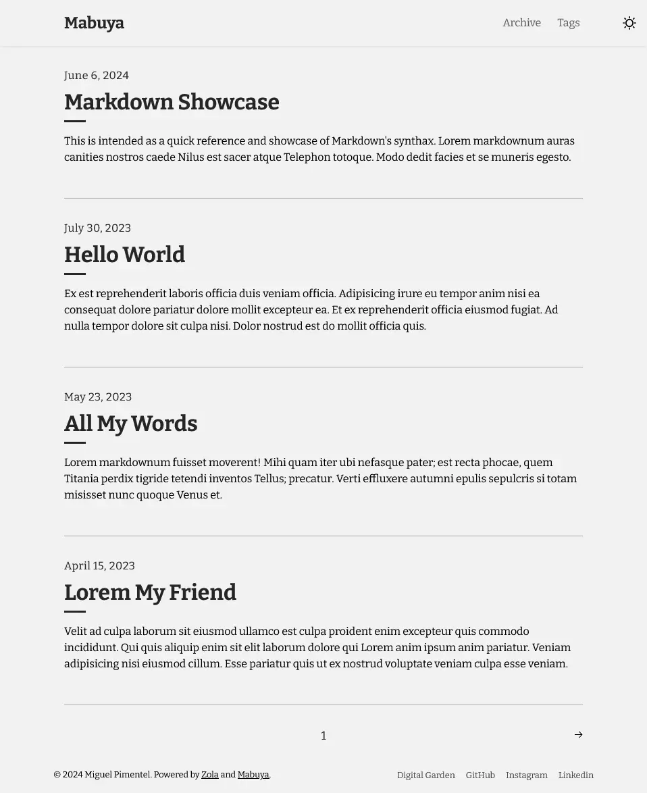

A lightweight Zola theme for creating fast, SEO-optimized blogs. Put your work front and center with Mabuya as your project's foundation.

[Demo](https://mabuya.vercel.app/)

## Background

Forked from [Tale](https://github.com/aaranxu/tale-zola) with modern updates and improvements. The name comes from the [Mabuya hispaniolae](https://en.wikipedia.org/wiki/Mabuya_hispaniolae?useskin=vector), a possibly extinct species of skink endemic to the Dominican Republic.

## Features

- Simple blog layout
- Pagination support
- Tag system
- Dark theme with toggle
- Back-to-top button
- SEO optimization

## Screenshot

