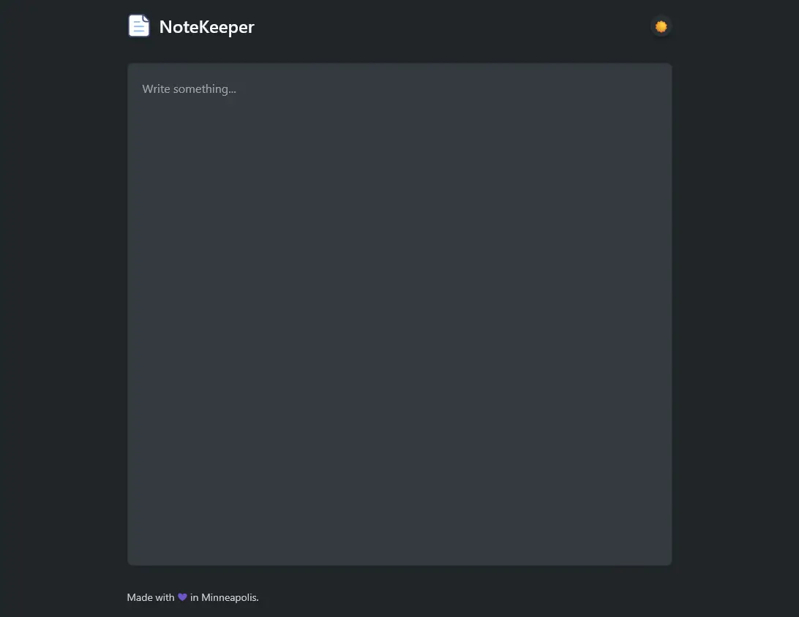

A Firefox extension that transforms the new tab into a minimalist, auto-saving text editor. Includes a sidebar companion for quick access.

## Features

- **Auto-save**: Content saves after every keystroke
- **Cross-device Sync**: Access notes across browser instances via Firefox Sync
- **Offline Support**: Works offline with browser sync support
- **Theme Detection**: Automatic dark/light theme based on system preferences
- **Responsive Design**: Works across devices and screen sizes
- **Sidebar Companion**: Quick access from the browser sidebar
- **Test Coverage**: Comprehensive test suite included

[View demo](https://semanticdata.github.io/notekeeper/)

## Screenshot

