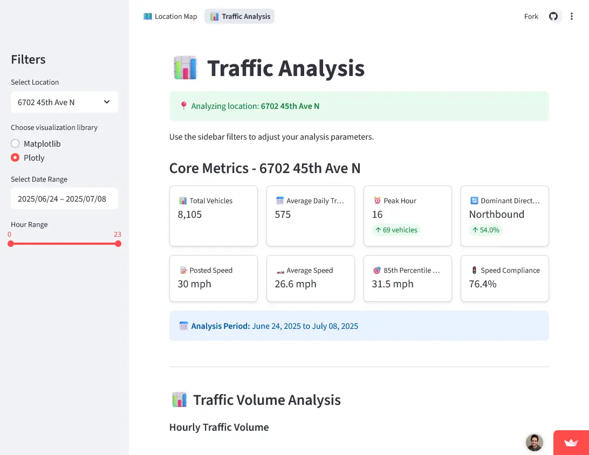

A comprehensive traffic analysis dashboard for Crystal, Minnesota, built with Streamlit. Processes and visualizes traffic data from PicoCount 2500 traffic counters to provide insights into traffic patterns, speed compliance, and vehicle classifications.

## Features

- Interactive Map: PyDeck-powered location map with clickable traffic study locations and real-time metrics
- Real-time Filtering: Filter by location, date range, and time periods
- Core Metrics: Speed compliance, peak hour analysis, traffic volume, and 85th percentile calculations
- Vehicle Classification: Analysis of 6 FHWA vehicle classes (motorcycles to heavy trucks)
- Speed Analysis: Compliance monitoring, violation severity tracking, and temporal patterns
- Performance Optimization: Memory-efficient processing with intelligent caching

## Key Metrics

- Total vehicle count and average speed analysis
- Speed compliance rate and violation severity tracking  
- Peak hour identification and dominant direction analysis
- Vehicle distribution across classes (motorcycles, passenger cars, pickups, buses, trucks)

## Screenshot

